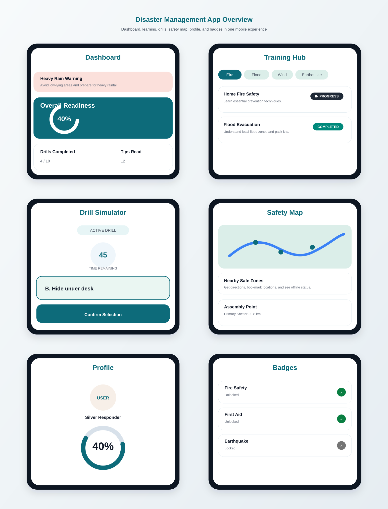

# Disaster Management

Disaster Management is an Android app built with Jetpack Compose for disaster preparedness training. It combines readiness tracking, scenario-based drills, local safe-zone guidance, and achievement badges into one mobile experience.

## What The App Does

- Shows an overall readiness score and personal activity stats
- Surfaces live-style risk alerts for flood and earthquake conditions
- Provides a training hub with categorized learning modules
- Runs interactive drill simulations with timed multiple-choice scenarios
- Displays nearby safe zones on an OpenStreetMap view
- Tracks progress, badges, and learning milestones in the profile area

## Screenshots

The screenshot overview below is committed to the repo so the README stays useful on GitHub without external hosting.



## Features

- Clean Material 3 UI with bottom navigation and a persistent top app bar
- Readiness dashboard with animated progress and emergency alerts
- Training hub with category filters for fire, flood, wind, and earthquake modules
- Drill simulator with countdown timer, answer validation, and explanations
- Safety map with nearby shelters, directions, bookmarks, and offline map status
- Profile screen with readiness breakdown, badge progress, and leaderboard cards
- Badge overview screen for tracking unlocked and locked achievements

## Tech Stack

- Kotlin
- Jetpack Compose
- Navigation Compose
- Material 3
- Coil for image loading
- osmdroid for the map screen
- AndroidX Lifecycle and ViewModel

## Requirements

- Android Studio Hedgehog or newer recommended
- Android SDK 24+
- Internet access for remote images and map tiles
- Location permission for the safety map `My Location` feature

## Getting Started

1. Clone the repository.
2. Open the project in Android Studio.
3. Let Gradle sync finish.
4. Run the `app` module on an emulator or device.

## Permissions Used

The app requests the following permissions in `AndroidManifest.xml`:

- `INTERNET`
- `ACCESS_NETWORK_STATE`
- `ACCESS_COARSE_LOCATION`
- `ACCESS_FINE_LOCATION`

## Project Structure

```text
app/src/main/java/com/example/disastermanagement/
  MainActivity.kt
  navigation/
  ui/
    components/
    screens/
    state/
    theme/
```

## Notes

- The app currently uses seeded training modules, safe zones, and drill scenarios from the `AppViewModel`.
- Remote images are loaded from network URLs, so screens with images need connectivity.
- The map screen uses OpenStreetMap tiles through osmdroid.

## License

No explicit license file is included in the repository.
